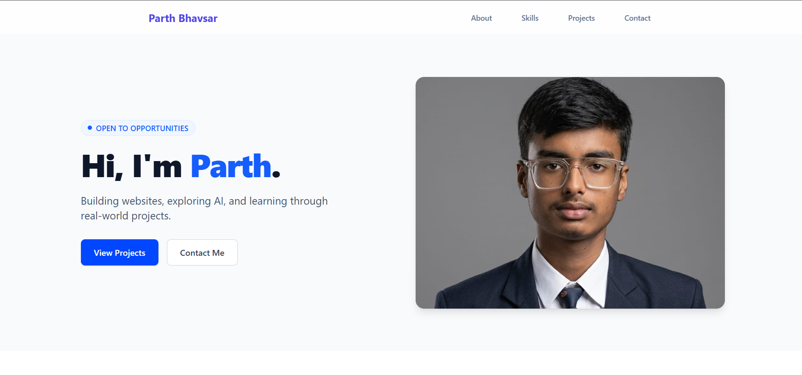

# 🌐 Parth Bhavsar Portfolio

A modern, responsive portfolio website built with React and Tailwind CSS to showcase my skills, projects, and learning journey.

## 🚀 Live Website

https://my-portfoilio-pyrikyjc-parth-s-lab.vercel.app/

## 📂 Repository

https://github.com/parthbhavsar0207/My-Portfoilio

---

## ✨ Features

- Responsive design
- Modern UI with Tailwind CSS
- Smooth animations using Framer Motion
- Project roadmap section
- Contact section with social links
- Custom favicon
- SEO metadata
- Open Graph preview support

---

## 🛠 Tech Stack

- React
- Vite
- Tailwind CSS
- JavaScript
- Framer Motion
- Heroicons

---
## 📸 Preview

---

## 📦 Run Locally

Clone the project

```bash
git clone https://github.com/parthbhavsar0207/My-Portfoilio.git
```

Go to the project folder

```bash
cd portfolio
```

Install dependencies

```bash
npm install
```

Start the development server

```bash
npm run dev
```

---
## 📬 Contact

LinkedIn
https://www.linkedin.com/in/parth-bhavsar-088822325/
GitHub
https://github.com/parthbhavsar0207
Email
parthb100922@gmail.com
---
## 📄 License
This project is open source and available under the MIT License.
